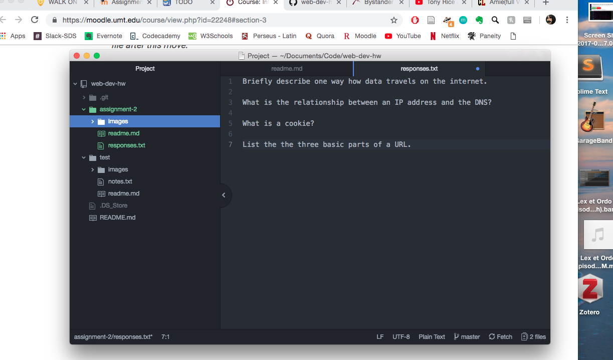

# Assignment 2 Technical Report
[my responses](./assignment.txt)

Version Control is used by developers to track their changes to a project, and changes made by other developers on their team. We're using it so that we can record changes to our files, and because it is best practice in the development/coding industry.

Work Cycle Summary
I have been learning a lot about mark down and getting used to using the desktop version of Github. I actually used to use the command line to push changes, but so far I find the desktop app a lot more intuitive and user-friendly. I didn't really have any issues, but at times I struggled with remembering the code for markdown. It's a new language for me. I didn't post any issues to the repo yet.
