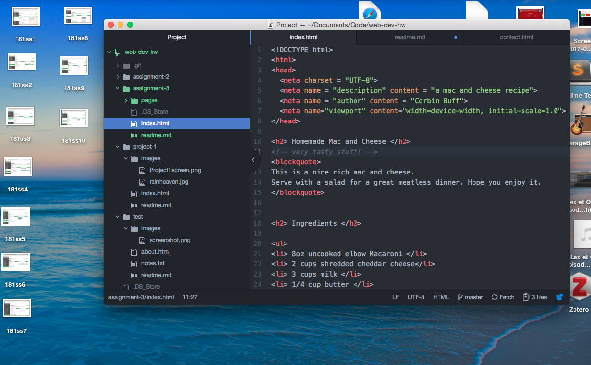

# My Assignment 3 README

There are 5 different main head elements. You can have infinite body elements. The body is the main content of the site rendered by the browser and most of what the user sees. The head content is to tell the browser and processor information about the HTML document.

Structural markup is information about the structure of a document. It helps guide a user visually. Semantic markup reinforces the meaning of specific information in the document.

I was familiar with html from past experience so had a pretty easy time refamiliarizing myself with most of this section. The meta content in the head was largely new to me, I must have forgotten it or not learned it before. Other than that everything was smooth and I didn't run into any problems.

