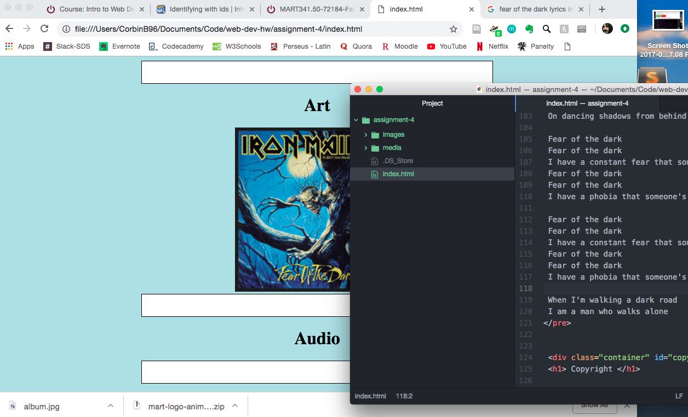

A.) On line 1, using a h1 or h2, title your README.md.

B.) Briefly describe the difference between divs, classes, ids, and spans.

C.) What is "alt text," and why do we use it?

D.) Summarize your work cycle for this assignment. Review this page if you need some ideas.

E.) Embed a screenshot of your workspace at some point during your development cycle.

## Assignment 4 README

Divs are used to specify a large area of html. Classes are used to specify multiple html elements. IDs are used to specify a specific html element. Spans are used to specify a small area of html.

Alt text is used in case a form of media will not work or display in the browser as an alternate way of communicating what it is.

