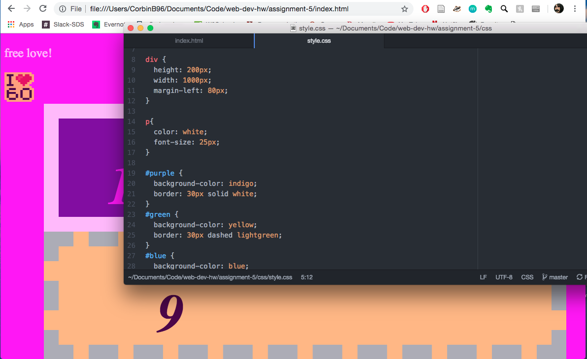

# Assignment 5 Readme

I decided to do the 1960s for my decade of choice because I really enjoy the music. I tried to replicate the psychedelic feeling of the time but choosing very vivid colors, lots of pinks and yellows and orange.

I used magenta, pink, yellow, blue, and purple. This was in attempt to replicate the psychedelic and tie-dye style designs of the 60s.

I am familiar with CSS so I didn't run into too much trouble during this assignment. I don't think the color scheme does a great job of conveying the 60s but it was the best I could do. If I had more time I would have tried to get more of a tie dye feel to the page. But I like the colors overall.

