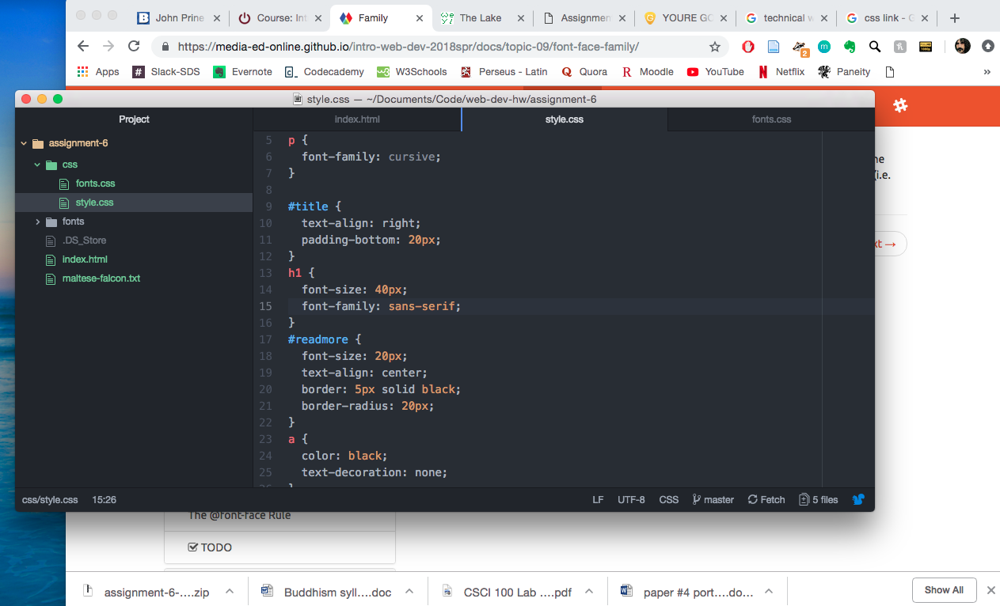

## Assignment 6 readme

I chose a cursive font for the story itself and a san-serif font for the title as I felt they complemented each other.

Fallbacks and font stacks are important incase the browser can't process the preferred font, it literally has something to fall back on.

My work cycle was efficient. I didn't run into any difficulties and felt like I understood things clearly.

