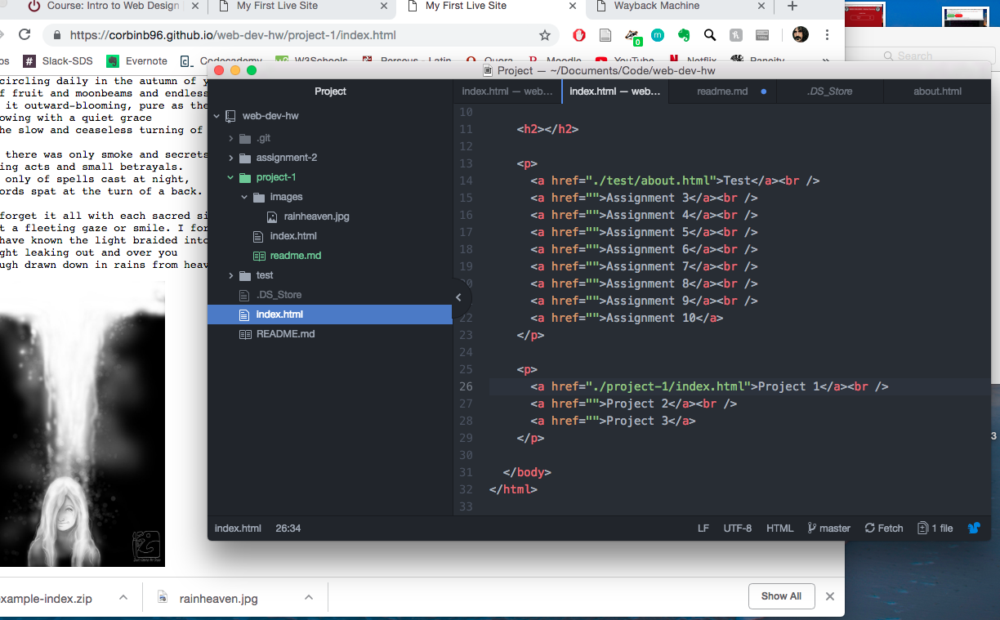

# Techincal Report

I exclusively use Google Chrome to surf the web on my laptop. On my phone I use Safari. A browser presents the web resource you choose by requesting it from the server and displaying it in the browser window. The resource is usually an HTML document. The location of the resource is specified by the user with a URI or Uniform Resource Identifier.

I used the Wayback Machine to go to feedmag.com and viewed it as it looked on Feb 25 1997. Web Design was clearly a lot less advanced. There is lots of white space and the page is not very responsive. Design has definitely gotten a lot more engaging to the user since then.

I really enjoyed building a simple site and adding a poem into it. I had trouble getting github pages to display my index.html rather than my readme for a while. I think it simply takes a while for it to reprocess. And then I linked to my page (https://corbinb96.github.io/web-dev-hw/project-1/index.html) using a comma (index,html) instead of a period, so it took me a while to see that and correct it. Other than that I didn't have any major challenges and enjoyed the assignment.

