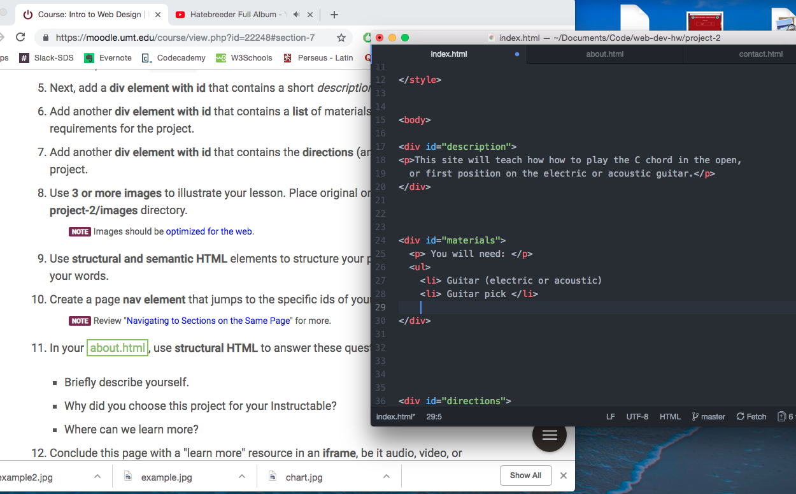

## Project 2 README

A lot of HTML was remembering old stuff I had already learned. The meta tags were new and very cool though.

I am pretty familiar with CSS but there is plenty of room for improvement. I'm excited to learn more.

I found this assignment fun and pretty easy. I didn't really run into any problems, and it was nice to practice new stuff like the iframes again.

