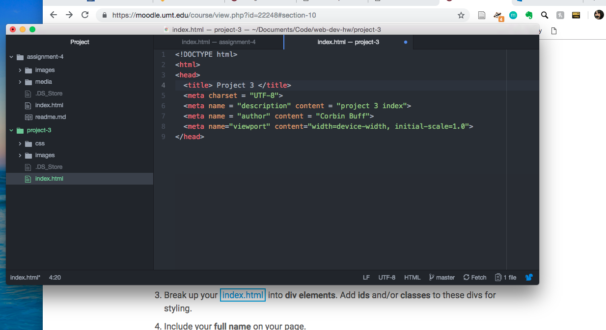

## Project 3 README

Padding controls the surface immediately around an element. Margin targets the margins of the webpage itself. A border is what surrounds an html element.

I had trouble centering everything and getting my list of links to look good.

I was a bit rushed during the assignment but still feel that it came out well. It's nice to have a portfolio of the work I've done for this class and I'm proud of what I built this semester.

